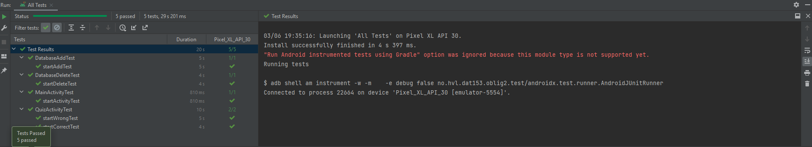

# Dat153_Oblig2
Oblig2 Quiz app Version 2

Updated oblig1 quiz app with adding Room database support and adding some espresso tests

5 tests.
- Check if the button on the main activity works
- Check if the correct answer to the quiz activity gives points
- Check if the wrong answer to the quiz activity does not give points
- Check if deleting an item in the database actually removes the item in the database and not just in the user interface
- Check if adding element in database actually adds the element in the database and not just in the user interface

# DatabaseAddTest
startAddTest:
Checks the size of the database
Adds one element to the database
Checks that the element has been added to the database to see if the size of the database has increased by one element

# DatabaseDeleteTest
startDeleteTest:
Checks the size of the database
Deletes an element in the database
Checks that the element has been deleted from the database to see if the size of the database has become smaller with one element

# MainActivityTest

startActivityTest:
Click button for quiz activity.
Checks if what is displayed on the screen is the same as the quizActivity layout

# QuizActivityTest
startWrongTest:
Answers incorrectly to quiz questions
Checks if the score does not increase

startCorrectTest:
Answer quiz questions correctly
Checks if the score increases

